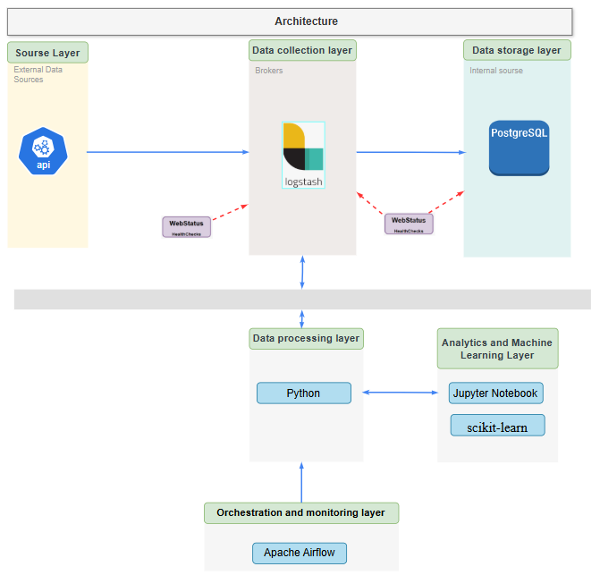

# Бизнес кейс «Umbrella»

1.1. Развернуть ВМ [ubuntu_mgpu.ova](https://disk.yandex.ru/d/Psofa9xtbgUEOw) в [VirtualBox](https://disk.yandex.ru/d/3fD00plnL_a4Cw).

1.2. Клонировать на ПК задание **Бизнес кейс Umbrella** в домашний каталог ВМ. 

`git clone https://github.com/BosenkoTM/workshop-on-ETL.git`

проект `https://github.com/BosenkoTM/workshop-on-ETL/tree/main/business_case_umbrella_25`

1.3. Запустить контейнер `01_umbrella.py` с кейсом, изучить и описать основные элементы интерфейса `Apache Airflow`. 

1.4. Спроектировать верхнеуровневую архитектуру для `real_umbrella.py` аналитического решения задания **Бизнес кейс Umbrella** в `draw.io`. Необходимо использовать:
   - `Source Layer` - слой источников данных.
   - `Storage Layer` - слой хранения данных.
   - `Business Layer` - слой для доступа к данным бизнес пользователей.

     Основная архитектура примера `01_umbrella.py`:



1.5. Результаты работы представить в виде файла `ФИО.pdf` предобученую модель `ml_model.pkl` выгрузить в учебный портал `moodle`.
## Содержание

Этот пример кода содержит следующие `DAG`:
- `01_umbrella.py` - `DAG`, иллюстрирующий вариант использования бизнес кейса "Umbrella" в модельном виде.
- `real_umbrella.py` - `DAG`, иллюстрирующий вариант использования бизнес кейса "Umbrella", который автоматизирует весь pipeline обработки погодных и продажных данных, обучения модели машинного обучения и её "развёртывания".

в строке DAGа `real_umbrella.py` 

```
-  1. Получение прогноза погоды
def fetch_weather_forecast():
    api_key = "_____________________________________"  # замените на ваш API ключ
```
добавить свой API, который требуется получить после авторизации на сайте `https://www.weatherapi.com/`
    
## Использование

Чтобы начать работу с примерами кода, запустите Airflow в докере, используя следующую команду:
1. Собираем Docker-образ из текущей директории (.) и присваивает ему тег `custom-airflow:slim-2.8.1-python3.11`.
   ```bash
   sudo docker build -t custom-airflow:slim-2.8.1-python3.11 .
   ```
2. Собираем (если нужно) и запускает все сервисы, описанные в `docker-compose.yml`.
   ```bash
   sudo docker compose up --build
   ```
3. Если требуется полностью пересобрать образ и запустить по новому контейнеры с сетью
   ```bash
   sudo docker system prune -a --volumes -f
    ```
4. Для работы с `DAG` перейти по линку `http://localhost:8080/`.

   Чтобы остановить выполнение примеров, выполните следующую команду:

    ```
    sudo docker compose down
    ```
    
## Индивидуальные задания

 | Вариант | Задание 1 | Задание 2 | Задание 3 |
|----------|-----------|------------|------------|
| 1 | Получить прогноз погоды в Москве на 3 дня | Сохранить поля: date, avgtemp_c | Сохранить как CSV |
| 2 | Получить прогноз в Санкт-Петербурге на 5 дней | Преобразовать дату в формат YYYY-MM-DD | Построить график температуры |
| 3 | Получить прогноз в Лондоне на 7 дней | Отфильтровать дни с температурой > 10°C | Сохранить в CSV-файл |
| 4 | Получить прогноз в Берлине на 3 дня | Рассчитать среднюю температуру | Вывести дату с самой высокой температурой |
| 5 | Получить данные по координатам 48.85, 2.35 (Париж) на 7 дней | Оставить только столбцы: date, avgtemp_c | Найти минимальную температуру |
| 6 | Получить прогноз в Риме на 5 дней | Заменить пропуски средним значением | Построить bar chart |
| 7 | Получить прогноз в Мадриде на 7 дней | Добавить столбец "тепло/холодно" (порог 15°C) | Подсчитать количество "тёплых" дней |
| 8 | Получить прогноз в Токио на 3 дня | Преобразовать JSON-ответ в таблицу pandas | Сохранить в формате Excel |
| 9 | Получить прогноз в Афинах на 3 дня | Округлить значения температуры | Построить линейный график температуры по дням |
| 10 | Получить прогноз в Нью-Йорке на 3 дня | Удалить строки с пропусками | Построить таблицу: дата и температура |
| 11 | Получить прогноз в Лос-Анджелесе на 5 дней | Отсортировать по температуре (по убыванию) | Сохранить топ-3 самых жарких дня |
| 12 | Получить прогноз в Амстердаме на 7 дней | Отфильтровать дни с температурой < 0°C | Посчитать среднюю температуру |
| 13 | Получить прогноз в Праге на 3 дня | Добавить столбец: разница с предыдущим днём | Построить таблицу изменений температуры |
| 14 | Получить прогноз в Варшаве на 5 дней | Сгруппировать данные и найти среднее по рабочим дням | Визуализировать результат в таблице |
| 15 | Получить прогноз в Бангкоке на 7 дней | Сравнить температуры первого и последнего дня | Вывести результат на экран |
| 16 | Получить прогноз в Дубае на 3 дня | Отобразить даты с температурой > 30°C | Вывести количество таких дней |
| 17 | Получить прогноз в Хельсинки на 5 дней | Заполнить пропуски значением 0 | Сохранить в parquet-файл |
| 18 | Получить прогноз в Стокгольме на 3 дня | Удалить дубликаты | Построить таблицу "Дата — Температура" |
| 19 | Получить прогноз в Вене на 5 дней | Отфильтровать прогноз на выходные | Посчитать среднюю температуру выходных |
| 20 | Получить прогноз в Киеве на 7 дней | Добавить столбец: "день недели" | Построить график температура по дням недели |


