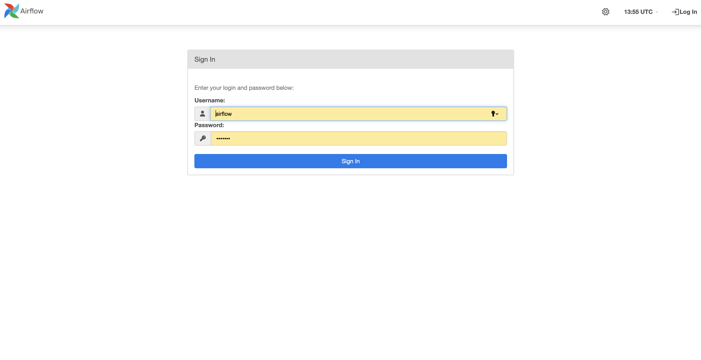
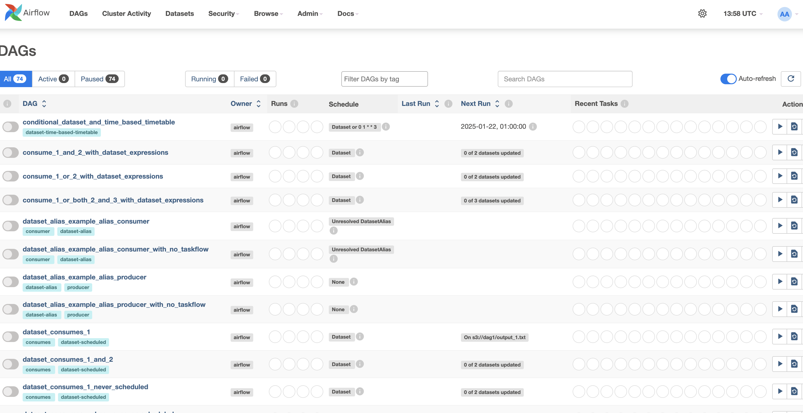
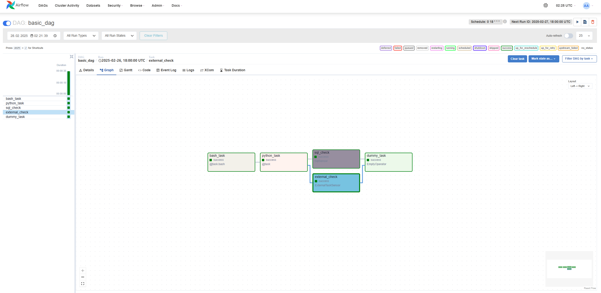
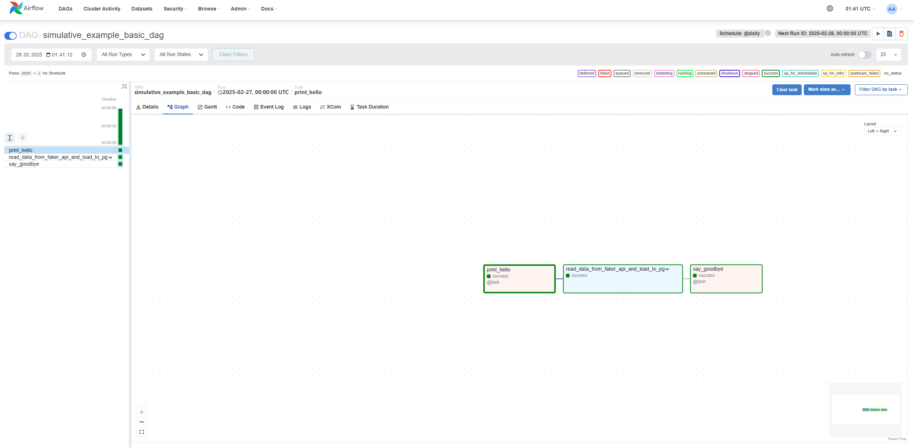
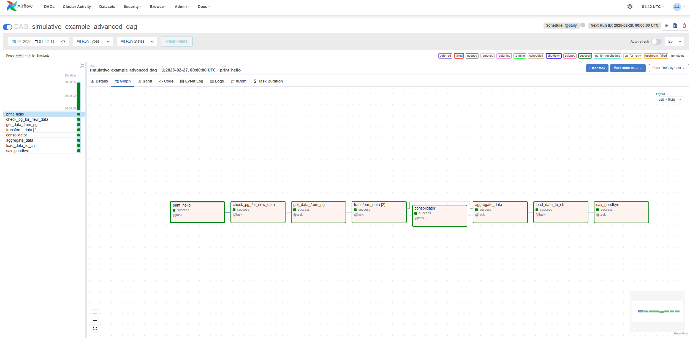

# Построение ETL-пайплайна для обработки данных с использованием современного стека технологий

## Практический вебинар: Разработка системы генерации и анализа пользовательских данных

### Технологический стек:
- `FastAPI` для генерации фейковых данных.
- `Apache Airflow` для оркестрации ETL-процессов.  
- `PostgreSQL` как основное хранилище данных.
- `ClickHouse` для аналитической обработки.
- `MinIO` для объектного хранения.
- `Docker` для контейнеризации.

### Ключевые темы:
1. Настройка локального окружения разработки.
2. Создание микросервиса на `FastAPI`.
3. Работа с различными типами баз данных.
4. Разработка ETL-пайплайнов в `Apache Airflow`.
5. Практика использования `Docker` для развертывания инфраструктуры.
6. Анализ и визуализация данных.

### Практическая часть:
- Разработка полного цикла обработки данных.
- Работа с реальными инструментами и технологиями.
- Решение прикладных задач анализа данных.
- Создание визуализаций и дашбордов.


# Simulative. Webinar: FastApi + Airflow + Postgres + Clickhouse + Minio

[miro](https://miro.com/app/board/uXjVLn3nIQM=/?share_link_id=388365212080)

## 1. Подготовим окружение

Создадим файл `.gitignore`

```bash
touch .gitignore
echo .idea >> .gitignore
echo .venv >> .gitignore
echo .env >> .gitignore
```

Инициализируем репозиторий

```bash
git init
```

Создадим виртуальное окружение

```bash
python -m venv .venv
source .venv/bin/activate
```

Установим необходимые зависимости

```bash
pip install -r requirements.txt
```

Настроим pre-commit

```yaml
# .pre-commit-config.yaml

repos:
  - repo: https://github.com/pre-commit/pre-commit-hooks
    rev: v4.5.0
    hooks:
      - id: check-merge-conflict
      - id: trailing-whitespace
        args: [--markdown-linebreak-ext=md]
      - id: end-of-file-fixer
      - id: check-toml
      - id: check-yaml
        args: ["--unsafe"]
      - id: check-symlinks
      - id: check-added-large-files
        args: ["--maxkb=3000"]
      - id: requirements-txt-fixer
      - id: detect-private-key

  - repo: https://github.com/psf/black
    rev: 24.2.0
    hooks:
      - id: black
        args:
          - --line-length=99
          - --exclude=/.venv/

  - repo: https://github.com/PyCQA/flake8
    rev: 7.0.0
    hooks:
      - id: flake8
        args:
          - --max-line-length=99
 ```

Установим pre-commit

```bash
pip install pre-commit
pre-commit install
```

Создадим makefile

```bash
# Makefile

SHELL := /bin/bash
PY = .venv/bin/python

.PHONY: up-services down-services up-af down-af lint

lint:
	pre-commit run --all-files
	pre-commit run --all-files

up-services:
	docker-compose -f docker-compose-services.yaml up -d --build

down-services:
	docker-compose -f docker-compose-services.yaml down -v

up-af:
	docker-compose -f docker-compose-af.yaml up -d --build

down-af:
	docker-compose -f docker-compose-af.yaml down -v
```

Подготовим файлы `.env` и `.env.example` с переменными окружения

```bash
# .env

PG_HOST=localhost
PG_PORT=5432
PG_USER=postgres
PG_PASSWORD=postgres
PG_DATABASE=postgres
CH_HOST=localhost
CH_PORT=8123
CH_USER=default
CH_PASSWORD=password
CH_DATABASE=default
AIRFLOW_UID=50000
AIRFLOW_GID=0
AIRFLOW_PROJ_DIR=./airflow
_PIP_ADDITIONAL_REQUIREMENTS='clickhouse-driver==0.2.9 minio'
```

## 2. Напишем сервис на FastAPI, который будет генерировать фейковых пользователей

Создадим директорию нашего сервиса

```bash
mkdir fakerApi
```

Подготовим файл с зависимостями нашего сервиса

```bash
pip freeze >> fakerApi/requirements.txt
```

Подготовим Dockerfile для создания [Docker](https://www.docker.com/) образа нашего сервиса

```bash
# Dockerfile

FROM python:3.12-slim

WORKDIR /app

COPY requirements.txt .
RUN pip install --no-cache-dir -r requirements.txt

COPY . .

CMD ["uvicorn", "app.app:app", "--host", "0.0.0.0", "--port", "8000"]
```

Создадим директории нашего [FastAPI](https://fastapi.tiangolo.com/) приложения

```bash
mkdir app
mkdir app/models
touch app/models/person.py
mkdir app/handlers
touch app/handlers/person.py
touch app/app.py
```

Напишем модель ответа нашего приложения

```python
# fakerApi/app/models/person.py

import datetime
import uuid

from pydantic import BaseModel
from typing import Optional


class PersonResponse(BaseModel):
    id: uuid.UUID
    name: str
    age: int
    address: str
    email: str
    phone_number: str
    registration_date: datetime.datetime
    created_at: datetime.datetime
    updated_at: datetime.datetime
    deleted_at: Optional[datetime.datetime] = None

```

Напишем обработчик запроса к нашему приложению

```python
# fakerApi/app/handlers/person.py

import datetime

from fastapi import APIRouter
from faker import Faker
from app.models.person import PersonResponse

router = APIRouter(prefix="/person", tags=["person"])

faker = Faker(locale="ru_RU")


@router.get("/", response_model=PersonResponse)
async def get_person():
    person = PersonResponse(
        id=faker.uuid4(),
        name=faker.name(),
        age=faker.random_int(min=18, max=99),
        address=faker.address(),
        email=faker.email(),
        phone_number=faker.phone_number(),
        registration_date=faker.date_time_between(start_date="-1y", end_date="now"),
        created_at=faker.date_time_between(start_date="-1y", end_date="now"),
        updated_at=datetime.datetime.now(),
        deleted_at=None,
    )
    return person
```

Напишем логику точки входа в наше приложение

```python
# fakerApi/app/app.py

import uvicorn
from fastapi import FastAPI
from app.handlers.person import router as person_router

app = FastAPI()

app.include_router(person_router)


@app.get("/")
async def root():
    return {"message": "Hello, Simulative!"}


if __name__ == "__main__":
    uvicorn.run(app, host="0.0.0.0", port=8000)
```

`docker-compose-services.yaml` напишем в следующем пункте

## 3. Поднимем инстансы Postgres, Clickhouse, Minio и fakerApi

Напишем `docker-compose-services.yaml`

```bash
# docker-compose-services.yaml

services:
  pg:
    image: postgres:latest
    container_name: pg
    env_file:
      - ./.env
    environment:
      - POSTGRES_PASSWORD=${PG_PASSWORD}
      - POSTGRES_USER=${PG_USER}
      - POSTGRES_DB=${PG_DATABASE}
    ports:
      - "5432:5432"
    healthcheck:
      test: /usr/bin/pg_isready
      interval: 10s
      timeout: 10s
      retries: 5
    restart: unless-stopped
    volumes:
      - ./init/pg:/docker-entrypoint-initdb.d

  zookeeper:
    image: zookeeper:latest
    container_name: zookeeper
    hostname: zookeeper

  ch:
    image: clickhouse/clickhouse-server:24-alpine
    container_name: ch
    hostname: ch
    ports:
      - "8123:8123"
      - "9000:9000"
    volumes:
      - ./data/clickhouse/node1:/etc/clickhouse-server
      - ./init/ch:/docker-entrypoint-initdb.d
    depends_on:
      - zookeeper
    healthcheck:
      test: wget --no-verbose --tries=1 http://127.0.0.1:8123/ping || exit 1
      interval: 10s
      timeout: 10s
      retries: 5

  minio:
    image: quay.io/minio/minio
    command: server /minio_data --console-address ":9001"
    ports:
      - "9001:9000"  # Remap MinIO API port
      - "9002:9001"  # Remap MinIO Console port
    environment:
      - MINIO_ROOT_USER=minioadmin
      - MINIO_ROOT_PASSWORD=minioadmin
    volumes:
      - minio_data:/minio_data
    healthcheck:
      test: ["CMD", "curl", "-f", "http://localhost:9002/minio/health/live"]
      interval: 30s
      timeout: 20s
      retries: 3

  faker-api:
    build: fakerApi
    ports:
      - "8000:8000"
    depends_on:
      pg:
        condition: service_healthy
      ch:
        condition: service_healthy

volumes:
  minio_data:
```

Создадим вспомогательные для инициализации Postgres директории и файлы

```bash
mkdir init
mkdir init/pg
touch init/pg/db.sql
```

Создадим файл для инициализации целевой таблицы, который будет исполняться при создании контейнера с Postgres

```sql
-- init/pg/db.sql

create extension if not exists "uuid-ossp";

create table if not exists person (
    id uuid default uuid_generate_v4() primary key,
    name varchar(256),
    age integer,
    address varchar(256),
    email varchar(256),
    phone_number varchar(256),
    registration_date timestamp with time zone,
    created_at timestamp with time zone,
    updated_at timestamp with time zone,
    deleted_at timestamp with time zone
);
```

Теперь cоздадим вспомогательные для инициализации Clickhouse директории и файлы

```bash
mkdir data
mkdir data/clickhouse
mkdir data/clickhouse/node1
touch data/clickhouse/node1/config.xml
touch data/clickhouse/node1/users.xml
mkdir init/ch
touch init/ch/db.sql
```

Заполним вспомогательные файлы содержимым

```xml
<!--data/clickhouse/node1/config.xml-->

<?xml version="1.0"?>
<company>
    <logger>
        <level>debug</level>
        <console>true</console>
        <log remove="remove"/>
        <errorlog remove="remove"/>
    </logger>

    <query_log>
        <database>system</database>
        <table>query_log</table>
    </query_log>

    <listen_host>0.0.0.0</listen_host>
    <http_port>8123</http_port>
    <tcp_port>9000</tcp_port>
    <interserver_http_host>clickhouse-node1</interserver_http_host>
    <interserver_http_port>9009</interserver_http_port>

    <max_connections>4096</max_connections>
    <keep_alive_timeout>3</keep_alive_timeout>
    <max_concurrent_queries>100</max_concurrent_queries>
    <uncompressed_cache_size>8589934592</uncompressed_cache_size>
    <mark_cache_size>5368709120</mark_cache_size>

    <path>/var/lib/clickhouse/</path>
    <tmp_path>/var/lib/clickhouse/tmp/</tmp_path>
    <user_files_path>/var/lib/clickhouse/user_files/</user_files_path>

    <users_config>users.xml</users_config>
    <default_profile>default</default_profile>
    <default_database>default</default_database>
    <timezone>Europe/Moscow</timezone>
    <mlock_executable>false</mlock_executable>

    <remote_servers>
        <company_cluster>
            <shard>
                <replica>
                    <default_database>shard</default_database>
                    <host>ch</host>
                    <port>9000</port>
                </replica>
            </shard>
        </company_cluster>
    </remote_servers>

    <zookeeper>
        <node index="1">
            <host>zookeeper-ch</host>
            <port>2181</port>
        </node>
    </zookeeper>

    <macros>
        <cluster>company_cluster</cluster>
        <shard>1</shard>
        <replica>ch</replica>
    </macros>

    <distributed_ddl>
        <path>/clickhouse/task_queue/ddl</path>
        <pool>default</pool>
    </distributed_ddl>

    <format_schema_path>/var/lib/clickhouse/format_schemas/</format_schema_path>
</company>
```

```xml
<!--data/clickhouse/node1/users.xml-->

<?xml version="1.0"?>
<company>
    <profiles>
        <default>
            <distributed_ddl_entry_format_version>2</distributed_ddl_entry_format_version>
            <max_memory_usage>10000000000</max_memory_usage>
            <use_uncompressed_cache>0</use_uncompressed_cache>
            <load_balancing>in_order</load_balancing>
            <log_queries>1</log_queries>
        </default>
    </profiles>

    <users>
        <default>
            <password></password>
            <profile>default</profile>
            <networks>
                <ip>::/0</ip>
            </networks>
            <quota>default</quota>
        </default>
        <admin>
            <password>123</password>
            <profile>default</profile>
            <networks>
                <ip>::/0</ip>
            </networks>
            <quota>default</quota>
        </admin>
    </users>

    <quotas>
        <default>
            <interval>
                <duration>3600</duration>
                <queries>0</queries>
                <errors>0</errors>
                <result_rows>0</result_rows>
                <read_rows>0</read_rows>
                <execution_time>0</execution_time>
            </interval>
        </default>
    </quotas>
</company>
```

Создадим файл для инициализации целевой таблицы, который будет исполняться при создании контейнера с Clickhouse

```sql
-- init/ch/db.sql

create table if not exists person_count_by_city (
    city String,
    name Int64
)
engine = MergeTree()
primary key city
order by city;
```

Запустим наши инстансы Postgres, Clickhouse, Minio и fakerApi с помощью команды `Makefile`

```bash
make up-services
```

Проверим работоспособность через IDE (dbeaver / datagrip) и curl

```bash
curl localhost:8000/person/

# {"name":"Миронова Полина Филипповна","age":85,"address":"д. Цимлянск, алл. Пограничная, д. 160 к. 49, 523868","email":"novikoveduard@example.com","phone_number":"8 (986) 389-0428","registration_date":"2024-04-23T18:33:50.346207","created_at":"2024-08-01T05:22:00.539628","updated_at":"2024-06-25T02:19:17.921913","deleted_at":null}
```

Все в порядке, наш сервис по генерации пользователей готов

## 4. Поднимем инстанс Airflow

Скачаем официальный docker-compose.yaml - [Running Airflow in Docker](https://airflow.apache.org/docs/apache-airflow/stable/howto/docker-compose/index.html)

```bash
curl -LfO 'https://airflow.apache.org/docs/apache-airflow/2.10.4/docker-compose.yaml'
mv docker-compose.yaml docker-compose-af.yaml
```

Пробросим наши соединения в Airflow. Для этого создадим необходимые директории и файлы

```bash
mkdir airflow
mkdir airflow/dags
mkdir airflow/logs
mkdir airflow/data
touch airflow/data/connections.yaml
```

Наполним `airflow/data/connections.yaml` содержимым

```yaml
# airflow/data/connections.yaml

postgres:
  conn_type: postgres
  host: pg
  schema: postgres
  login: postgres
  password: postgres
  port: 5432

ch:
  conn_type: clickhouse
  host: ch
  schema: default
  login: admin
  password: "123"
  port: 9000

faker:
  conn_type: http
  host: faker-api
  schema: http
  port: 8000

minio:
  conn_type: aws
  login: minioadmin
  password: minioadmin
  extra: {"endpoint_url": "minio:9000", "region_name": "us-east-1"}
```

Внесем небольшое изменение в `docker-compose-af.yaml`

```bash
# docker-compose-af.yaml

# line ~75
  environment:
    ...
    AIRFLOW__SECRETS__BACKEND: airflow.secrets.local_filesystem.LocalFilesystemBackend
    AIRFLOW__SECRETS__BACKEND_KWARGS: '{"connections_file_path": "/opt/airflow/data/connections.yaml"}'
  volumes:
    - ${AIRFLOW_PROJ_DIR:-.}/dags:/opt/airflow/dags
    - ${AIRFLOW_PROJ_DIR:-.}/logs:/opt/airflow/logs
    - ${AIRFLOW_PROJ_DIR:-.}/config:/opt/airflow/config
    - ${AIRFLOW_PROJ_DIR:-.}/plugins:/opt/airflow/plugins
    - ${AIRFLOW_PROJ_DIR:-.}/data:/opt/airflow/data
```

Запустим наш инстанс Airflow с помощью команды `Makefile`

```bash
make up-af
```

Проверим работу Airflow через UI, перейдя по адресу http://localhost:8080



Залогинившись, мы попадем на дашборд ДАГов, которые созданы в Airflow. В данном случае это ДАГи-примеры реализации различного функционала Airflow



## 5. Напишем наш первый DAG

```bash
touch airflow/dags/basic_dag.py
```

```python
# airflow/dags/basic_dag.py

import datetime

from airflow.models.dag import DAG
from airflow.operators.dummy import DummyOperator
from airflow.decorators import task
from airflow.sensors.sql import SqlSensor
from airflow.sensors.external_task_sensor import ExternalTaskSensor


with DAG(
    dag_id="basic_dag",
    schedule="0 18 * * *",
    start_date=datetime.datetime(2025, 1, 1),
    catchup=False,
    tags=["simulative"],
) as dag:

    @task.bash
    def bash_task():
        return "echo https://airflow.apache.org/"

    @task
    def python_task():
        print("Hello Python!")

    bash_task = bash_task()

    python_task = python_task()

    sql_sensor = SqlSensor(
        task_id='sql_check',
        conn_id='postgres',
        sql="""SELECT 1""",
    )

    external_sensor = ExternalTaskSensor(
        task_id='external_check',
        external_dag_id='simulative_example_basic_dag',
        external_task_id='print_hello',
        execution_date_fn=lambda dt: dt,
        dag=dag
    )

    dummy_task = DummyOperator(task_id="dummy_task")

    bash_task >> python_task >> [sql_sensor, external_sensor] >> dummy_task
```

С помощью UI мы можем видеть визуальное отображение нашего DAG, включающего Task Group


## 6. Напишем DAG с использованием PythonOperator, TaskGroup, XCOM

Напишем DAG, в рамках которого будет происходить обращение к нашему сервису `fakerApi` для получения данных о пользователе, которые затем будут загружаться в Postgres

Но перед этим напишем файл со вспомогательными функциями

```bash
touch airflow/dags/utils.py
```

```python
def get_minio_client():
    import json
    from airflow.hooks.base import BaseHook
    from minio import Minio

    minio_conn = BaseHook.get_connection("minio")

    endpoint_url = json.loads(minio_conn.extra)["endpoint_url"]

    minio_client = Minio(
        endpoint_url,
        access_key=minio_conn.login,
        secret_key=minio_conn.password,
        secure=False,
    )

    return minio_client


def write_data_to_minio(minio_client, data, name):
    import json
    from io import BytesIO

    data_json = json.dumps(data).encode("utf-8")
    data_stream = BytesIO(data_json)
    minio_client.put_object(
        "mybucket",
        name,
        data_stream,
        len(data_json),
        content_type="application/json",
    )


def get_pg_engine():
    import sqlalchemy
    from airflow.hooks.base import BaseHook

    pg_conn = BaseHook.get_connection("postgres")

    dsn = f"postgresql://{pg_conn.login}:{pg_conn.password}@{pg_conn.host}"
    dsn += f":{pg_conn.port}/{pg_conn.schema}"

    pg_engine = sqlalchemy.create_engine(dsn)

    return pg_engine


def get_ch_client():
    from clickhouse_driver import Client
    from airflow.hooks.base import BaseHook

    ch_conn = BaseHook.get_connection("ch")

    client = Client(
        host=ch_conn.host,
        port=ch_conn.port,
        database=ch_conn.schema,
        user=ch_conn.login,
        password=ch_conn.password,
    )

    return client
```

Теперь можем перейти к написанию основного файла


```bash
touch airflow/dags/simulative_example_basic_dag.py
```

```python
# airflow/dags/simulative_example_basic_dag.py

import datetime

from airflow.decorators import task, task_group
from airflow.models.dag import DAG


with DAG(
    dag_id="simulative_example_basic_dag",
    schedule="@daily",
    start_date=datetime.datetime(2025, 1, 1),
    catchup=False,
    tags=["simulative"],
) as dag:

    @task
    def print_hello():
        print("Hello, Simulative!")

    @task_group(group_id="read_data_from_faker_api_and_load_to_pg")
    def read_data_from_faker_api_and_load_to_pg():

        @task
        def read_data_from_faker_api(ti):
            import json
            import requests
            from io import BytesIO
            from airflow.hooks.base import BaseHook
            from utils import get_minio_client

            minio_client = get_minio_client()

            if not minio_client.bucket_exists("mybucket"):
                minio_client.make_bucket("mybucket")

            faker_api_conn = BaseHook.get_connection("faker")

            response = requests.get(
                f"http://{faker_api_conn.host}:{faker_api_conn.port}/person"
            )

            if response.status_code == 200:
                data = response.json()
                data_json = json.dumps(data).encode("utf-8")
                data_stream = BytesIO(data_json)
                minio_client.put_object(
                    "mybucket",
                    data["id"],
                    data_stream,
                    len(data_json),
                    content_type="application/json",
                )
                ti.xcom_push(key="mydata", value=data["id"])
            else:
                print(f"Error: {response.status_code}")

        @task
        def load_data_to_pg(ti):
            import json
            from io import BytesIO
            import pandas as pd
            from utils import get_minio_client, get_pg_engine

            data_id = ti.xcom_pull(key="mydata")
            print(data_id)

            minio_client = get_minio_client()

            data = minio_client.get_object("mybucket", data_id)

            json_data = json.load(BytesIO(data.read()))

            pg_engine = get_pg_engine()

            df = pd.DataFrame.from_dict(json_data, orient="index").T

            df.to_sql("person", pg_engine, if_exists="append", index=False)

            print(f"Loaded {len(df)} rows to PostgreSQL. Table: person")

        read = read_data_from_faker_api()

        load = load_data_to_pg()

        read >> load

    @task
    def say_goodbye():
        print("Goodbye, Simulative!")

    hello = print_hello()

    main = read_data_from_faker_api_and_load_to_pg()

    goodbye = say_goodbye()

    hello >> main >> goodbye
```

С помощью UI мы можем видеть визуальное отображение нашего DAG, включающего Task Group


## 7. Напишем продолжение нашего ETL процесса с использованием Dynamic Task Mapping

Напишем DAG, в рамках которого будет проверяться исходная таблица в Postgres на наличие новых данных, динамически создаваться задачи для обработки новых данных с последующей их агрегацией через Minio и загрузкой в Clickhouse

```bash
touch airflow/dags/simulative_example_advanced_dag.py
```

```python
# airflow/dags/simulative_example_advanced_dag.py

import datetime

from airflow.decorators import task
from airflow.models.dag import DAG


with DAG(
    dag_id="simulative_example_advanced_dag",
    schedule="@daily",
    start_date=datetime.datetime(2025, 1, 1),
    catchup=False,
    tags=["simulative"],
) as dag:

    @task
    def print_hello():
        print("Hello, Simulative!")

    @task
    def check_pg_for_new_data(ti):
        import time
        import psycopg2.extras
        from utils import get_pg_engine

        query = "select min(updated_at) as dt from public.person"
        query += " where updated_at >= now() - interval '5 minute';"

        pg_engine = get_pg_engine()

        conn = pg_engine.raw_connection()

        with conn.cursor(cursor_factory=psycopg2.extras.RealDictCursor) as cur:
            while True:
                cur.execute(query)
                data = cur.fetchone()
                if data.get("dt") is None:
                    print("No new data")
                    time.sleep(5)
                    continue
                else:
                    print(f"New data: {data['dt']}")
                    ti.xcom_push(key="dt", value=data["dt"])
                    return True

    @task
    def get_data_from_pg(ti):
        import pandas as pd
        import psycopg2.extras
        from utils import get_minio_client, write_data_to_minio, get_pg_engine

        minio_client = get_minio_client()

        if not minio_client.bucket_exists("mybucket"):
            minio_client.make_bucket("mybucket")

        dt = ti.xcom_pull(key="dt")

        pg_engine = get_pg_engine()

        conn = pg_engine.raw_connection()

        with conn.cursor(cursor_factory=psycopg2.extras.RealDictCursor) as cur:
            cur.execute(f"select * from public.person where updated_at >= '{dt}';")
            data = cur.fetchall()

        df = pd.DataFrame(data)

        print(f"Got {len(df)} rows from PostgreSQL. Table: person")

        df["id"] = df["id"].astype(str)
        df["city"] = df.apply(lambda row: row["address"].split(",")[0], axis=1)

        output = []

        for city in df["city"].unique():
            output.append(city)
            data = df[df["city"] == city].to_json(date_format="iso")
            write_data_to_minio(minio_client, data, city)

        ti.xcom_push(key="mydata", value=output)

        print(f"Got {len(output)} groups of rows from PostgreSQL. Table: person")

        return output

    @task
    def transform_data(input):
        import json
        import pandas as pd
        from utils import get_minio_client, write_data_to_minio

        minio_client = get_minio_client()

        item = minio_client.get_object("mybucket", input)

        json_data = json.loads(item.read().decode("utf-8"))
        json_data = json.loads(json_data)

        df = pd.DataFrame.from_dict(json_data, orient="index").T

        print(f"Got {len(df)} rows from PostgreSQL. Table: person")

        df = (
            df.groupby("city")
            .agg({"name": "count"})
            .reset_index()
            .to_dict(orient="records")
        )

        print(f"Got {len(df)} rows after aggregation. Table: person_count_by_city")

        write_data_to_minio(minio_client, df, f"{input}_groupped")

        return f"{input}_groupped"

    @task
    def consolidator(input):
        output = []

        for i in range(len(input)):
            output.append(input[i])

        return output

    @task
    def aggregate_data(input):
        import json
        from io import BytesIO
        import pandas as pd
        from utils import get_minio_client, write_data_to_minio

        minio_client = get_minio_client()

        print(input)

        dfs = []

        for city in input:

            local_data = minio_client.get_object("mybucket", city)

            json_data = json.load(BytesIO(local_data.read()))

            df = pd.DataFrame(json_data)

            dfs.append(df)

        df = pd.concat(dfs)

        print(f"Got {len(df)} rows from PostgreSQL. Table: person")

        output = df.to_json(date_format="iso", orient="records")

        write_data_to_minio(minio_client, output, "final")

        return "final"

    @task
    def load_data_to_ch(input):
        import json
        import pandas as pd
        from utils import get_minio_client, get_ch_client

        minio_client = get_minio_client()

        ch_client = get_ch_client()

        data = minio_client.get_object("mybucket", input)
        json_data = json.loads(data.read().decode("utf-8"))
        json_data = json.loads(json_data)
        df = pd.DataFrame(json_data)

        ch_client.insert_dataframe(
            "insert into person_count_by_city values", df, settings={"use_numpy": True}
        )

        print(f"Loaded {len(df)} rows to ClickHouse. Table: person_count_by_city")

    @task
    def say_goodbye():
        print("Goodbye, Simulative!")

    ph = print_hello()

    sensor = check_pg_for_new_data()

    extract = get_data_from_pg()

    transform = transform_data.expand(input=extract)

    consolidated_data = consolidator(transform)

    aggregate = aggregate_data(consolidated_data)

    load = load_data_to_ch(aggregate)

    sg = say_goodbye()

    ph >> sensor >> extract >> transform >> aggregate >> load >> sg
```

С помощью UI мы можем видеть визуальное отображение нашего DAG


## 8. Пушим наши наработки на удаленный репозиторий

```bash
git remote add origin git@github.com:rushawx/airflowWebinarSimulative.git
git add .
git commit -m 'init'
git push --set-upstream origin main
```

Возможно `git add .` и `git commit -m 'init'` потребуется выполнить дважды из-за специфики работы pre-commit.


## Практическая работа на вебинаре

### Задание 1. Заполнение таблицы и анализ данных в PostgreSQL с визуализацией

#### Цель:
Заполнить таблицу `person` в базе данных PostgreSQL фейковыми данными не менее 10000 записей и провести анализ этих данных с использованием SQL. Также создать визуализации для полученных результатов.

#### Пункты задания:

1. **Заполнение таблицы фейковыми данными.**
   - Используйте библиотеку `Faker` для генерации фейковых данных.
   - Вставьте сгенерированные данные в таблицу `person` в базе данных PostgreSQL.

2. **Анализ возраста.**
   - Найдите средний, минимальный и максимальный возраст людей в таблице `person`.

3. **Анализ распределения по городам.**
   - Определите топ-5 городов, в которых проживает наибольшее количество людей.

4. **Анализ регистрации.**
   - Найдите количество регистраций в каждом месяце за последний год.

5. **Визуализация данных.**
   - Создайте графики для визуализации результатов анализа:
     - Гистограмма распределения возраста.
     - Диаграмма топ-5 городов по количеству проживающих.
     - Линейный график количества регистраций по месяцам.
    

### Задание 2. Анализ и визуализация данных в ClickHouse

#### Цель:
Провести анализ данных, загруженных в таблицу `person_count_by_city` в ClickHouse, и создать визуализации для полученных результатов.

#### Пункты задания:

1. **Анализ количества людей по городам.**
   - Найдите топ-10 городов с наибольшим количеством людей.
   - Найдите среднее количество людей в городах.

2. **Анализ распределения количества людей по городам:**
   - Постройте гистограмму распределения количества людей по городам.

3. **Анализ городов с минимальным и максимальным количеством людей:**
   - Найдите город с минимальным количеством людей.
   - Найдите город с максимальным количеством людей.

4. **Визуализация данных.**
   - Создайте графики для визуализации результатов анализа:
     - Диаграмма топ-10 городов по количеству проживающих.
     - Гистограмма распределения количества людей по городам.
     - Линейный график, показывающий минимальное и максимальное количество людей в городах.
